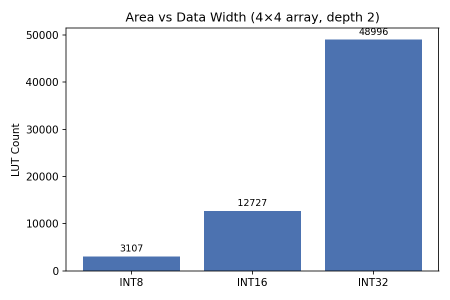
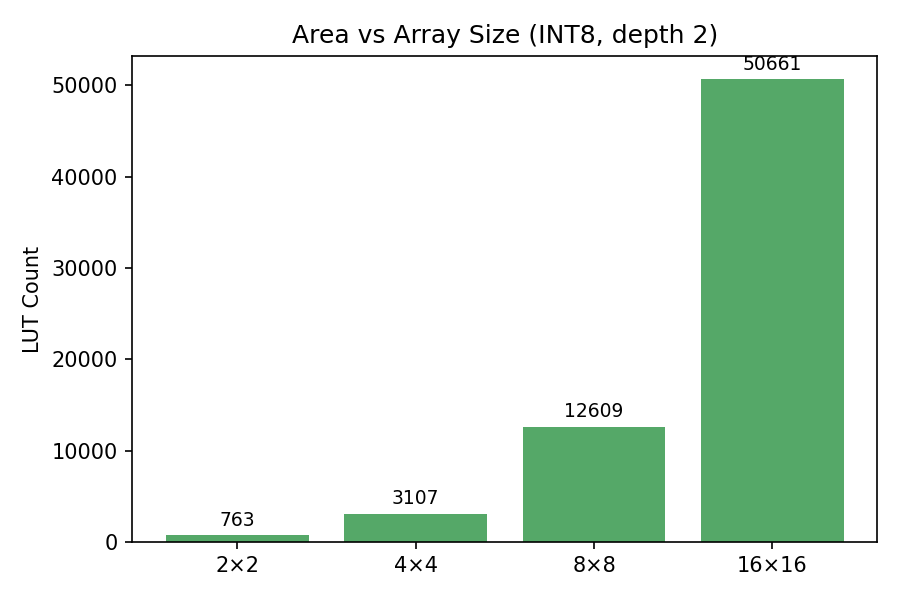
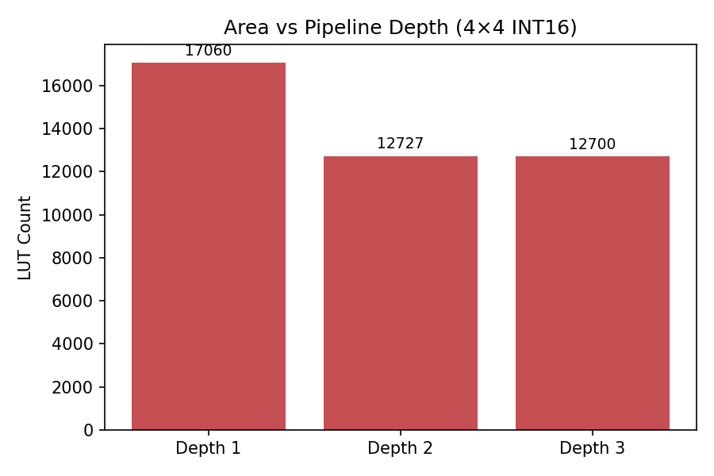
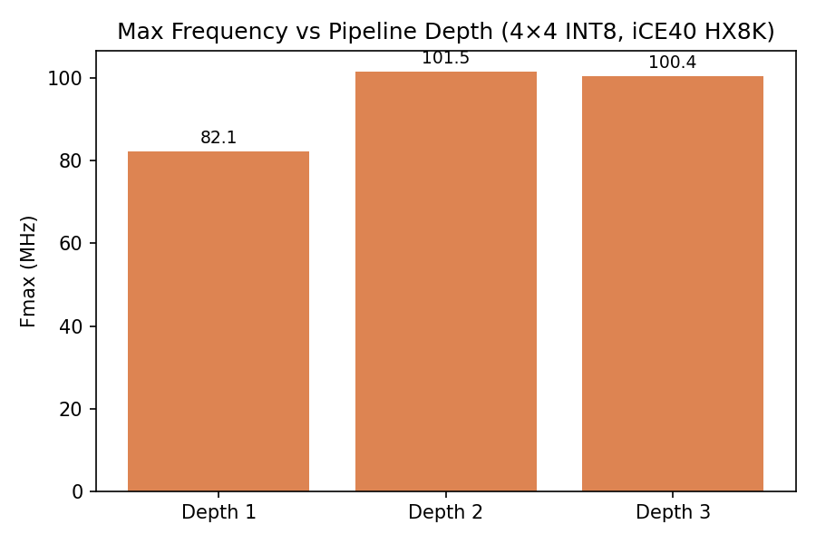
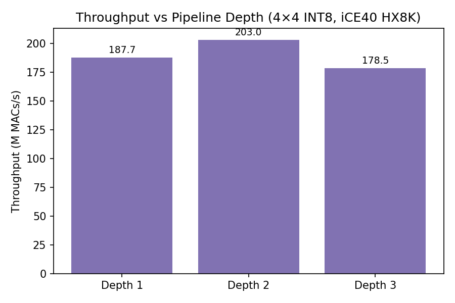

# Architecture Analysis

A pipelined systolic-array matrix-multiply accelerator in SystemVerilog, targeting weight-stationary dataflow in the style of the Google TPU. This document describes the architecture and analyzes its synthesis characteristics across configurations.

## 1. Architecture Overview

### Dataflow

The accelerator uses **weight-stationary** dataflow. Weights are pre-loaded into MAC units and remain fixed for the duration of a tile computation. Activations stream left-to-right through each row of the array, and partial sums accumulate top-to-bottom through each column. The result of C = A × B emerges from the bottom edge of the array.

```
          b_in[0]   b_in[1]   b_in[2]   b_in[3]
            ↓         ↓         ↓         ↓
          ┌─────┐   ┌─────┐   ┌─────┐   ┌─────┐
a_in[0] → │ MAC │──→│ MAC │──→│ MAC │──→│ MAC │
          │ 0,0 │   │ 0,1 │   │ 0,2 │   │ 0,3 │
          └──┬──┘   └──┬──┘   └──┬──┘   └──┬──┘
             ↓         ↓         ↓         ↓
          ┌─────┐   ┌─────┐   ┌─────┐   ┌─────┐
a_in[1] → │ MAC │──→│ MAC │──→│ MAC │──→│ MAC │
          │ 1,0 │   │ 1,1 │   │ 1,2 │   │ 1,3 │
          └──┬──┘   └──┬──┘   └──┬──┘   └──┬──┘
             ↓         ↓         ↓         ↓
          ┌─────┐   ┌─────┐   ┌─────┐   ┌─────┐
a_in[2] → │ MAC │──→│ MAC │──→│ MAC │──→│ MAC │
          │ 2,0 │   │ 2,1 │   │ 2,2 │   │ 2,3 │
          └──┬──┘   └──┬──┘   └──┬──┘   └──┬──┘
             ↓         ↓         ↓         ↓
          ┌─────┐   ┌─────┐   ┌─────┐   ┌─────┐
a_in[3] → │ MAC │──→│ MAC │──→│ MAC │──→│ MAC │
          │ 3,0 │   │ 3,1 │   │ 3,2 │   │ 3,3 │
          └──┬──┘   └──┬──┘   └──┬──┘   └──┬──┘
             ↓         ↓         ↓         ↓
         drain[0]  drain[1]  drain[2]  drain[3]
```

Horizontal arrows carry activations (a → a_out). Vertical arrows carry both weights during loading (b → b_out) and partial sums during compute (psum_in → psum_out).

### MAC Unit

Each MAC unit (`rtl/mac_unit.sv`) is a parameterized pipelined multiply-accumulate cell. The `PIPELINE_DEPTH` parameter selects between three variants:

- **Depth 1**: Combinational multiply-add, registered output. Single-cycle latency.
- **Depth 2** (default): Stage 1 registers the multiply result (`a × weight`), stage 2 adds the incoming partial sum. Two-cycle latency.
- **Depth 3**: Stage 1 registers the multiply, stage 2 registers the add, stage 3 passes through. Three-cycle latency.

All depths include passthrough registers: `a_out` forwards the activation to the right neighbor, `b_out` forwards the weight data downward (used during the weight-loading phase). A dedicated `weight_reg` latches the weight when `load_weight` is asserted and holds it stationary during compute.

### Systolic Array

The systolic array (`rtl/systolic_array.sv`) instantiates an N×N grid of MAC units and wires them together:

- **Activation flow**: Left edge inputs (`a_in`) pass through row-wise skew registers — row k is delayed by k cycles — then propagate right through MAC `a`/`a_out` chains.
- **Weight loading**: Top edge inputs (`b_in`) shift downward through `b`/`b_out` chains. Weights are fed in reverse row order (row N-1 first) so that after N cycles, MAC[k][j] holds B[k][j].
- **Partial sums**: Top row receives `psum_in = 0`. Each MAC adds its product to the incoming partial sum and passes it down. The bottom row's `psum_out` drives the `drain_out` port.

**Timing**: With pipeline depth 2 on an N×N array, C[m][j] appears at `drain_out[j]` at cycle N + m + j from compute start (N cycles of pipeline fill + diagonal skew). All N² results emerge over 2N - 1 cycles (the diagonal wave spans m + j = 0 through 2(N-1)).

### Controller

The controller (`rtl/controller.sv`) drives the array through tiled matrix multiplication for arbitrary M×K × K×N matrices (dimensions must be multiples of the array size). It sequences through five phases per tile:

1. **LOAD_WEIGHTS** (N cycles): Reads a tile of B from SP_B in reverse row order, feeding weights into the array.
2. **FEED** (N cycles): Reads a tile of A from SP_A row by row, streaming activations into the array.
3. **DRAIN** (N + N cycles): Array drains results from `drain_out` with diagonal timing. A register file captures each output element at its valid cycle.
4. **WRITEBACK** (N or 2N cycles): Writes drained results to SP_C. For the first K-tile (kt=0), this is a direct write. For subsequent K-tiles, it performs read-modify-write — interleaving read and write cycles on the single-port SRAM to accumulate partial results.
5. **Next tile or DONE**: Advances tile indices and loops back, or asserts `done`.

The tile loop order is weight-stationary: mt (M-dimension) is innermost, kt middle, nt outermost. When only mt advances, the weights are already in the MACs, so the controller skips LOAD_WEIGHTS and goes directly from WRITEBACK to FEED. This eliminates redundant weight loads — for an 8×8 matmul on a 4×4 array, 4 of 8 LOAD_WEIGHTS phases are skipped, saving 16 cycles (9% reduction).

The controller manages 1-cycle SRAM read latency by issuing pre-read addresses at each state transition boundary.

### Memory Subsystem

Three vector-wide scratchpads (`rtl/scratchpad.sv`) store tile data close to the array:

| Scratchpad | Entry Width | Contents |
|------------|-------------|----------|
| SP_A | ROWS × DATA_WIDTH | Activation rows |
| SP_B | COLS × DATA_WIDTH | Weight rows |
| SP_C | COLS × ACC_WIDTH | Result rows |

Each scratchpad is a synchronous single-port SRAM (register-based, read-first). The top-level module (`rtl/top.sv`) muxes between controller access (during computation) and an external host port (when idle) for loading inputs and reading results.

## 2. Synthesis Results

All results were obtained using Yosys (synthesis) targeting the Lattice iCE40 HX8K FPGA, with nextpnr-ice40 for place-and-route timing where noted. Source data: `synth/results.json`.

### Experiment 1: Data Width

4×4 array, pipeline depth 2. Each configuration uses ACC_WIDTH = 2 × DATA_WIDTH.

| Config | LUTs | FFs | Total Cells | Fmax |
|--------|------|-----|-------------|------|
| INT8 (ACC16) | 3,107 | 880 | 4,341 | 101.5 MHz |
| INT16 (ACC32) | 12,727 | 1,760 | 15,261 | — |
| INT32 (ACC64) | 48,996 | 3,520 | 54,152 | — |



### Experiment 2: Array Size

INT8 (ACC16), pipeline depth 2.

| Config | LUTs | FFs | Total Cells | Fmax |
|--------|------|-----|-------------|------|
| 2×2 | 763 | 200 | 1,036 | 106.0 MHz |
| 4×4 | 3,107 | 880 | 4,341 | 101.5 MHz |
| 8×8 | 12,609 | 3,680 | 17,842 | — |
| 16×16 | 50,661 | 15,040 | 72,145 | — |



### Experiment 3: Pipeline Depth — Area

4×4 array, INT16 (ACC32), synthesis only (no P&R).

| Depth | LUTs | FFs | Total Cells |
|-------|------|-----|-------------|
| 1 | 17,060 | 1,248 | 18,683 |
| 2 | 12,727 | 1,760 | 15,261 |
| 3 | 12,700 | 2,272 | 15,747 |



### Experiment 4: Pipeline Depth — Timing and Throughput

4×4 array, INT8 (ACC16), with P&R timing from nextpnr-ice40.

| Depth | LUTs | Compute Cycles | Fmax | Throughput |
|-------|------|----------------|------|------------|
| 1 | 4,420 | 7 | 82.1 MHz | 187.8 M MACs/s |
| 2 | 3,107 | 8 | 101.5 MHz | 203.0 M MACs/s |
| 3 | 3,102 | 9 | 100.4 MHz | 178.5 M MACs/s |

Throughput = N² × Fmax / compute_cycles, where compute_cycles = 2N - 1 + PD - 1.





## 3. Analysis

### Data Width Scaling

LUT count scales approximately 4× per doubling of data width: 3,107 → 12,727 (4.1×) for INT8 → INT16, and 12,727 → 48,996 (3.9×) for INT16 → INT32. This matches the theoretical expectation — a multiplier's gate count is proportional to the product of its operand widths, so doubling both operands quadruples the area.

Flip-flop count scales exactly 2× per doubling (880 → 1,760 → 3,520), which is expected since register count is linear in bit width.

The practical takeaway: INT8 arithmetic is roughly 4× cheaper in area than INT16. For inference workloads that tolerate quantization to 8-bit weights and activations, you can fit 4× more MACs in the same silicon area.

### Array Size Scaling

LUT count scales approximately 4× per doubling of N: 763 → 3,107 (4.1×) for 2×2 → 4×4, and 3,107 → 12,609 (4.1×) for 4×4 → 8×8. This confirms that area scales linearly with MAC count (which is N²), as expected for a regular array with no global interconnect.

Fmax remains roughly constant across array sizes: 106.0 MHz at 2×2 versus 101.5 MHz at 4×4. This confirms a key property of systolic designs — the critical path is local to a single MAC column (multiply → accumulate → next row), not across the full array. You can scale the array without degrading clock speed, at least up to the point where routing congestion or wire delays become dominant.

### Pipeline Depth Tradeoff

Pipeline depth 2 is the sweet spot for this design on iCE40:

**PD=1 → PD=2**: Fmax increases 24% (82.1 → 101.5 MHz) because the critical path splits from a single-cycle multiply+add into two shorter stages. LUT count also decreases from 4,420 to 3,107 — pipeline registers break long combinational paths into shorter cones that the synthesis tool can optimize independently, requiring fewer LUTs per stage. Throughput peaks at 203.0 M MACs/s despite the extra pipeline cycle (8 vs 7), because the frequency gain more than compensates.

**PD=2 → PD=3**: Fmax barely changes (101.5 → 100.4 MHz). The critical path at depth 2 is already short enough for the iCE40 fabric — adding another pipeline stage doesn't help. LUT count stays flat (3,107 → 3,102) since the combinational paths can't be simplified further. But compute cycles increase from 8 to 9, so throughput drops 12% to 178.5 M MACs/s. The extra stage adds ACC_WIDTH flip-flops per MAC (16 per MAC, 256 total across 16 MACs) for no frequency benefit.

Across all three depths, LUTs decrease monotonically (4,420 → 3,107 → 3,102) while FFs increase (624 → 880 → 1,136). This is the standard pipelining tradeoff: shorter combinational paths need fewer LUTs, at the cost of more registers. The sweet spot is where frequency gains from pipelining outweigh the extra cycle of latency — for iCE40, that's depth 2.

## 4. Memory Bandwidth and Scale

### Bandwidth Model

Each tile computation reads and writes the following scratchpad data:

- **SP_A**: N rows × (ROWS × DATA_WIDTH) bits = N² × DATA_WIDTH bits of activations
- **SP_B**: N rows × (COLS × DATA_WIDTH) bits = N² × DATA_WIDTH bits of weights
- **SP_C**: N rows × (COLS × ACC_WIDTH) bits = N² × ACC_WIDTH bits of results (read + write for RMW)

Each tile performs N² × N = N³ MAC operations (N² MACs in the array, each active for N FEED cycles). The scratchpad delivers one packed vector per cycle per port — ROWS values from SP_A, COLS values from SP_B — in separate phases.

For the default 4×4 INT8 configuration: per tile, the scratchpads transfer 16 bytes (A) + 16 bytes (B) + 32 bytes (C) = 64 bytes for 64 MACs, giving roughly **1 byte per MAC operation**. At 101.5 MHz, SP_A delivers 4 bytes/cycle during FEED (one activation per row), for a per-port bandwidth of ~406 MB/s.

### Comparison to Real Accelerators

NVIDIA's H100 GPU provides approximately 2 bytes/FLOP of memory bandwidth at peak, where each FLOP is a fused multiply-add (2 operations), giving ~1 byte/MAC — the same ratio as our design for a single tile.

Cerebras WSE-3 takes a fundamentally different approach: with ~44 GB of distributed on-die SRAM and 900,000 cores, it achieves far higher aggregate on-die bandwidth (~200+ bytes/FLOP) by placing memory directly next to compute, eliminating the off-chip memory bottleneck entirely. Our design's scratchpad-per-array approach is a miniature version of the same idea.

### Arithmetic Intensity

Matrix multiplication has O(N³) arithmetic operations on O(N²) data, giving O(N) arithmetic intensity — the ratio of compute to memory access improves linearly with problem size. Larger tiles are more compute-bound; smaller tiles are more memory-bound.

Our 4×4 tiles have arithmetic intensity of 4 (each element of A and B participates in 4 multiply-accumulate operations per tile). Real accelerators use 128×128 or 256×256 arrays to push arithmetic intensity to 128–256, making the compute vastly more efficient relative to memory traffic.

### Wafer-Scale Thought Experiment

Following the Cerebras WSE approach — what if we tiled our array across an entire wafer?

- **Single array**: 4×4 INT8, ~4,341 cells on iCE40. In a modern 7nm process, this is roughly ~0.05 mm².
- **Wafer capacity**: A 46,000 mm² wafer (Cerebras WSE-3 scale) could hold ~900,000 arrays, totaling 14.4 billion MAC units.
- **Peak throughput**: At 102 MHz, this gives ~1.47 ExaMACs/s (1.47 × 10¹⁸ MACs/s).
- **Bandwidth requirement**: At 1 byte/MAC and 16 MACs/cycle at 102 MHz, each array needs ~1.6 GB/s from its local scratchpad. Across 900,000 arrays: ~1.4 PB/s of aggregate on-die SRAM bandwidth.

This illustrates the fundamental challenge of wafer-scale compute: the arithmetic units are cheap — you can fit nearly a billion of them. But *feeding* them with data requires enormous on-die SRAM bandwidth that dwarfs anything achievable with off-chip memory. Cerebras addresses this by dedicating approximately 50% of the wafer's die area to SRAM, co-located with compute cores. The memory wall, not the compute wall, is what limits scaling.

## 5. Conclusions

**Key findings from this design:**

1. **INT8 is ~4× more area-efficient than INT16** per MAC unit. For inference workloads that can quantize, this is the single largest lever for increasing throughput per mm².

2. **Pipeline depth 2 is the sweet spot.** It gives the best throughput per unit area — a 24% Fmax improvement over depth 1, while depth 3 adds area without improving frequency. The optimal depth depends on the target fabric; on faster process nodes, depth 1 might suffice.

3. **Memory bandwidth is the bottleneck at scale.** A single array tile needs ~1 byte/MAC of scratchpad bandwidth. At wafer scale with hundreds of thousands of arrays, aggregate bandwidth reaches petabytes per second — achievable only with massive on-die SRAM.

4. **Weight-stationary loop order matters.** The controller's mt-innermost tile loop skips redundant weight loads when only the M-dimension advances. On an 8×8 matmul with a 4×4 array, this saves 9% of compute cycles. The benefit grows with the M-dimension: more activation tiles per weight load means better amortization of the LOAD_WEIGHTS cost.

**What a production design would change:**

- **Larger arrays** (128×128+) to increase arithmetic intensity and amortize control overhead.
- **SRAM macros** instead of register-based scratchpads, for 10–50× better density and lower power per bit.
- **Double-buffering** to overlap data loading with computation, hiding memory latency across tiles.
- **Multi-bank memory** with wider data buses to sustain bandwidth as array size grows.
